# Extracurricular Activity Registration System
### Final Year Project

A comprehensive web application for managing extracurricular activities, attendance tracking and user engagement in educational institutions. This system streamlines the process of creating, managing and participating in various activities.

---

## Project Overview

This platform serves as a centralized hub for students, coordinators and administrators to manage extracurricular activities efficiently.

### Core Capabilities:
- Role-based access control
- Real-time notifications
- QR code attendance marking
- Analytics dashboards

---

## Key Features

### For All Users
- **User Authentication** – Secure login with role-based access
- **Real-time Notifications** – Instant updates and reminders
- **Activity Discovery** – Browse and search activities
- **Registration Management** – Enroll with deadline tracking
- **Attendance Tracking** – View personal attendance stats
- **Interactive Calendar** – Visual schedule overview
- **Profile Management** – Update personal information

---

### For Students / Regular Users
- **Dashboard** – Upcoming activities & attendance summary
- **Activity Registration** – Easy enrollment
- **Attendance Summary** – Progress bars and visual stats
- **My Activities** – Track registered activities

---

### For Coordinators / Teachers
- **Activity Creation** – Multi-section activity form
- **Participant Management**
- **Attendance Marking** – Daily tracking interface
- **QR Code Generation & Scanning**
- **CSV Export**
- **Activity Analytics**

---

### For Administrators
- **Admin Dashboard**
- **User Management**
  - View, edit, delete users
  - Filter/search users
  - Export users to CSV
  - Manage registration status
  - View login history

- **User Addition Options**
  - Manual creation
  - Invitation links with roles

- **Activity Management**
- **Token Management**
- **Analytics Dashboard**
  - User registration trends
  - Activity creation patterns
  - Attendance analytics
  - Participation charts

---

### Common Features
- Responsive design (Tailwind CSS)
- Rich text editor (TinyMCE)
- File uploads (PDF, DOCX, images)
- Pagination

---

## Technology Stack

### Frontend
- React.js
- React Router DOM
- Tailwind CSS
- Chart.js & Recharts
- Axios
- React Toastify & SweetAlert2
- React Icons
- Framer Motion
- date-fns
- html5-qrcode
- react-qr-code
- @tinymce/tinymce-react
- react-csv
- file-saver & html-to-image

---

## Dashboard Components

### Admin Dashboard
- Total users
- Total activities
- Registration summary
- Activity trends (monthly chart)
- Attendance trends (bar chart)
- Participation (pie chart)
- Upcoming activities

### Coordinator Dashboard
- Activity creation trends
- Upcoming activities
- Management tools

### User Dashboard
- Upcoming activities
- Attendance summary (pie chart)
- Progress indicators

---

## User Roles and Permissions

| Role        | Permissions |
|------------|------------|
| Admin      | Full system access |
| Coordinator| Activity & attendance management |
| Teacher    | Similar to coordinator |
| Student    | Registration & attendance tracking |

---

## Key Pages and Components

### Authentication
- Login
- Forgot Password
- OTP Verification
- Set New Password
- Registration
- Registration Pending

### Main Pages
- Home
- Dashboards (User / Coordinator / Admin)
- Profile
- Calendar
- Notifications
- Terms & Conditions

### Activity Management
- Activity List
- Create Activity
- Edit Activity
- Activity Details
- Participants List
- Attendance Interface
- QR Scanner

### Admin Features
- Manage Users
- Add User
- Invitation Links
- Login History
- Token Management

---

## Screenshots (System Preview)

A quick visual overview of key parts of the system.

### Authentication
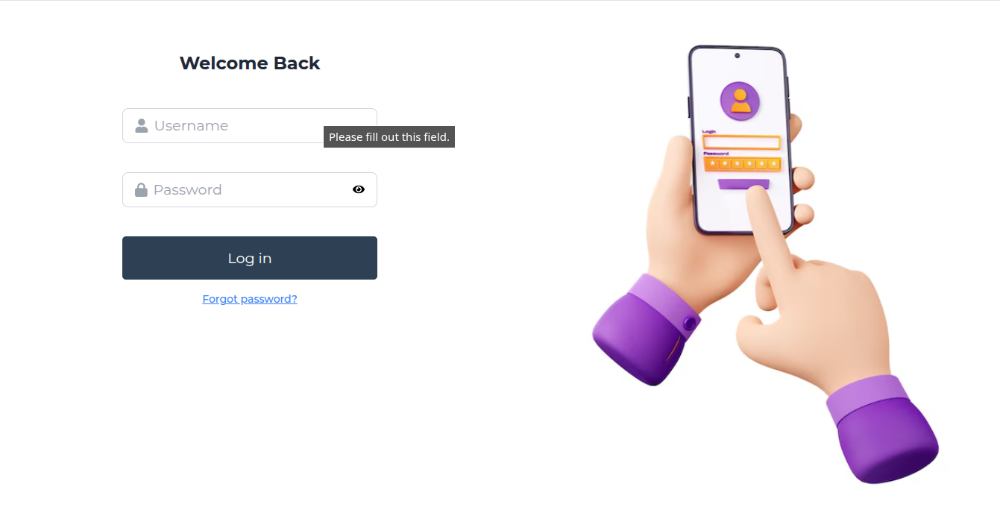
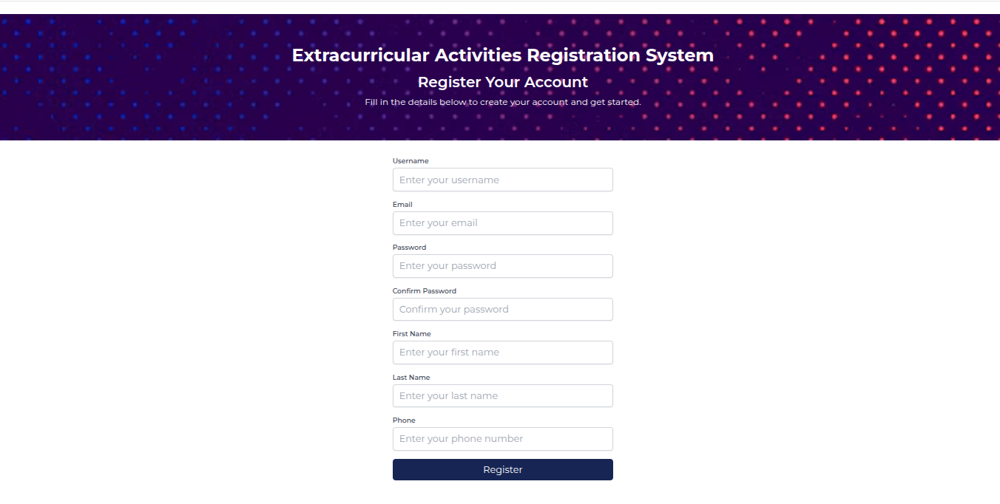

---

### Dashboards
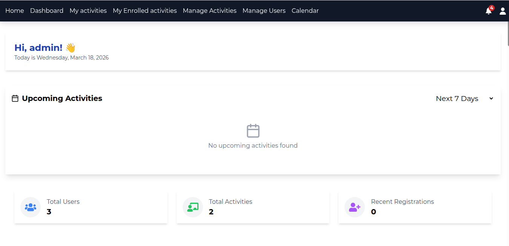
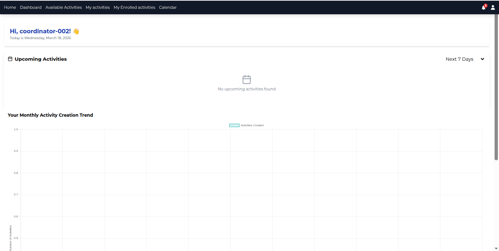
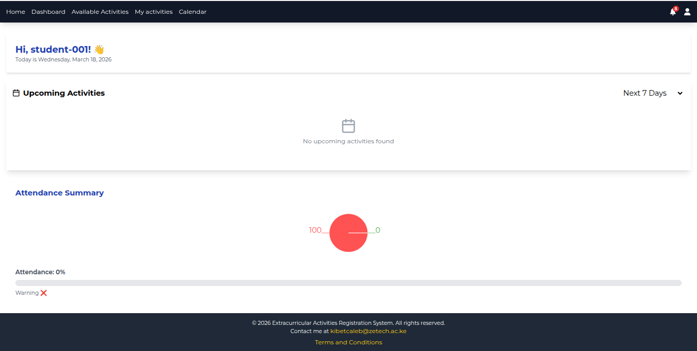

---

### Activity Management
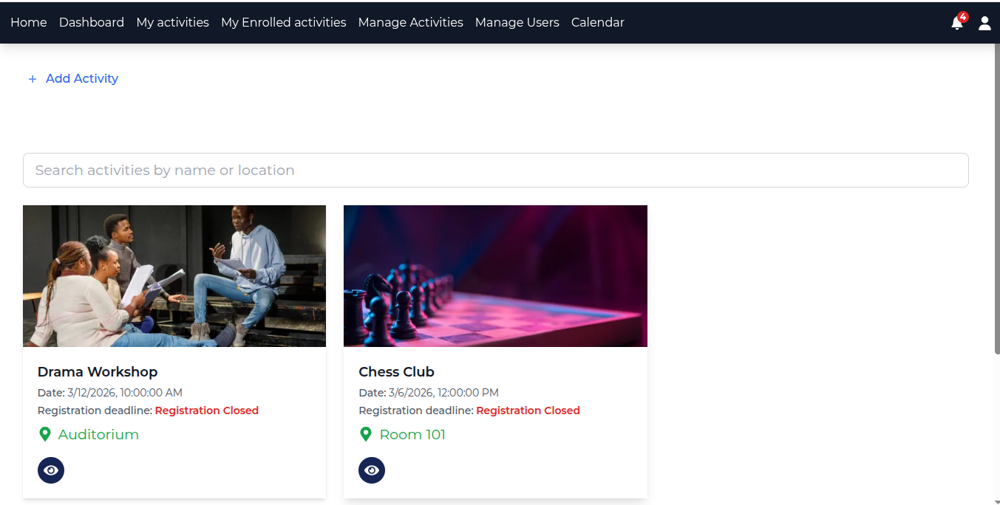
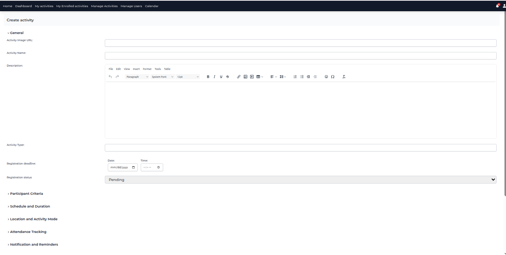
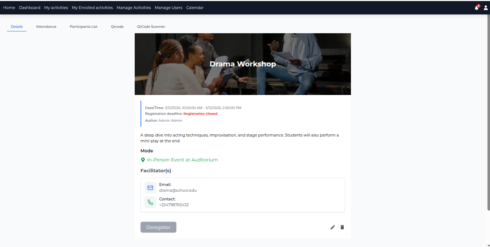

---

### User Management
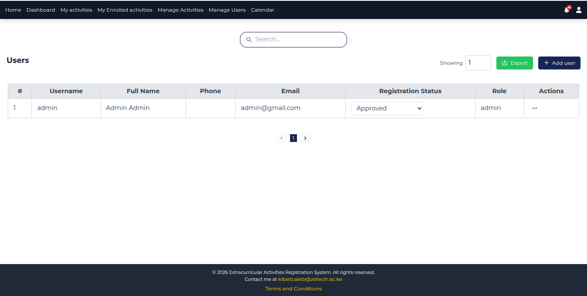
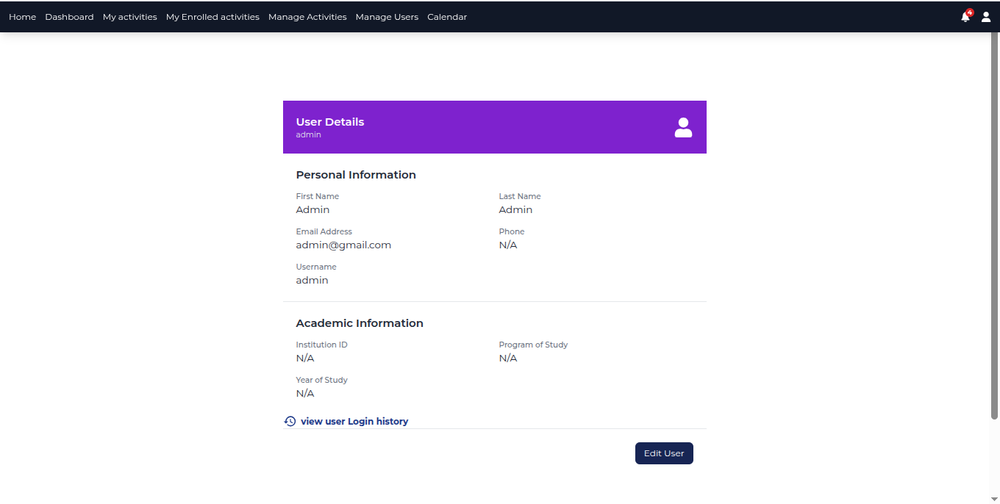

---

### Features
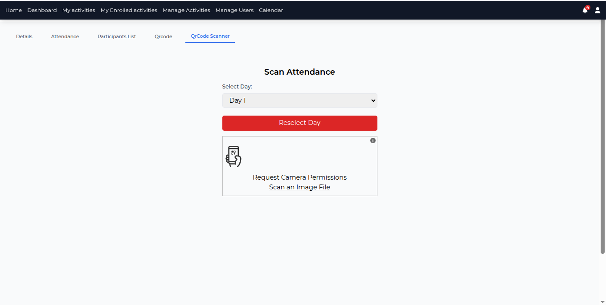
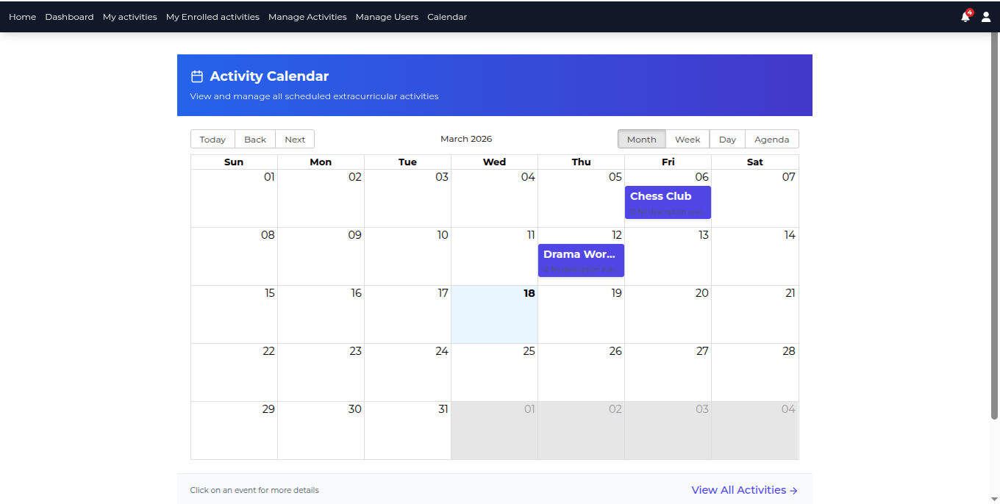
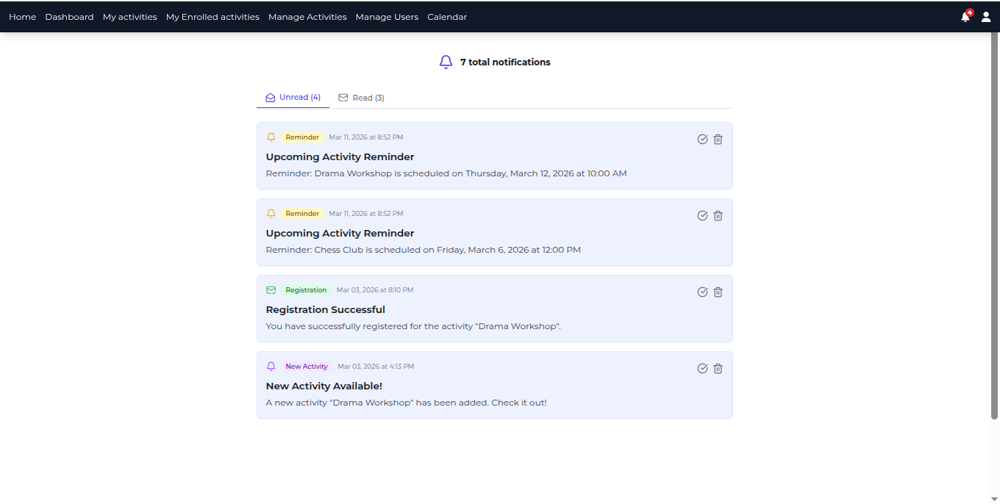

---

## Getting Started

### Prerequisites
- Node.js (v14 or higher)
- npm or yarn
- Backend API server (separate repository)

---

### Installation

```bash
# Clone repository
git clone https://github.com/Caleb-ne1/ECA-final-project-frontend.git

# Navigate into project
cd ECA-final-project-frontend.git

# Install dependencies
npm install
```


### Environment Variables

Create a .env file in the root directory:
```bash
VITE_APP_API_URL=http://localhost:5000
VITE_REGISTRATION_URL=http://localhost:5173
VITE_TINYMCE_KEY=your_tinymce_api_key
```

### Run the App

```bash
npm run dev
```

## API Documentation

This frontend communicates with a RESTful backend API.

All endpoints (authentication, users, activities, attendance, QR codes, notifications) are documented in the backend repository.

Backend Repo: 

```bash
https://github.com/Caleb-ne1/Final-project-extracurricular-registration-system-backend.git
```

Base URL: 

${import.meta.env.VITE_APP_API_URL}/api
